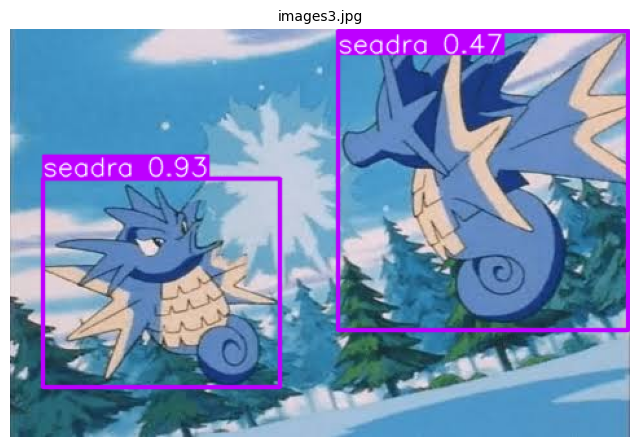
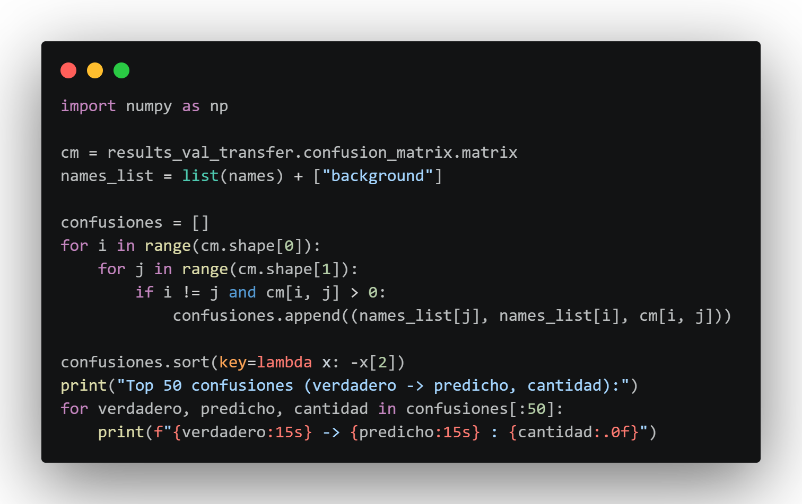
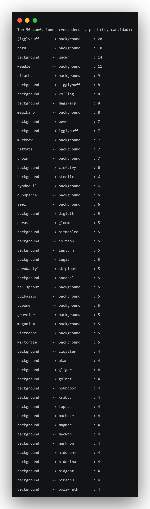

# pokemon-classifier-v2
Elaborado por Francisco Cisternas, Diego González e Ignacio Mora.




## Descripción
Este proyecto presenta un Python Notebook diseñado para la detección de objetos, enfocándose específicamente en los primeros 251 especímenes de la saga Pokémon, los cuales corresponden a las primeras 2 generaciones.

Elegimos esta temática motivados por la gran cantidad de ejemplares que componen la saga Pokémon. El hecho de que muchos de ellos sean ampliamente reconocibles y presenten diferencias significativas nos brindó la oportunidad perfecta para explorar y evaluar el comportamiento de los modelos de detección de objetos en escenarios de alta cardinalidad.

A continuación se listan las librerías más relevantes utilizadas:
- ``gdown``, se utilizó para descargar archivos alojados en Google Drive, en este caso el dataset por defecto.
- ``ultralytics``, se incluyó para hacer uso del modelo ``YOLO26n`` (You Only Look Once). 
- ``opencv`` o conocido también como ``cv2``, utilizado para la manipulación de imágenes, además de que YOLO la utiliza internamente para dibujar las bounding boxes y las etiquetas sobre las imágenes analizadas.
- ``pillow`` o conocido también como ``PIL``, utilizado para el procesamiento y manejo del formato de las imágenes.
- ``matplotlib``, utilizado para la generación de gráficos y visualización de datos.

## Matriz de Confusión

Debido a la alta cantidad de clases presentes en este proyecto, se optó por un enfoque distinto para la matriz de confusión, mostrando solamente los casos con mayor cantidad de errores.




Una interpretación de este gráfico, junto con el resto de las métricas se encuentra dentro del archivo ``pokemon-classifier-v2.ipynb``.

## Puesta en Marcha
### Obtención del Dataset
Para obtener el dataset se utilizó Web Scrapping, el cual se encuentra disponible en la siguiente ruta:
```
/pokemon-classifier-v2/scrapper
```
Es en esta ruta donde se encuentran las instrucciones para ejecutar el script localmente. 

### Obtencion de los Modelos
Para obtener los modelos se puede ejecutar directamente el archivo ``pokemon-classifier-v2.ipynb`` en Google Colab u obtenerlos mediante las carpeta de modelos que se encuentran en el repositorio.

### Google Colab
Este notebook fue diseñado originalmente para ejecutarse en entornos de Google Colab aprovechando la aceleración por GPU de las unidades T4.

#### Instrucciones

1. Abrir el notebook ``pokemon-classifier-v2.ipynb`` directamente en Google Colab.
2. Asegurarse de cambiar el entorno de ejecución para utilizar la aceleración por hardware.
    - Ir a ``Entorno de ejecución`` > ``Cambiar tipo de entorno de ejecución``.
    - Seleccionar la opción ``T4 GPU``.
4. Ejecutar secuencialmente las celdas para descargar un dataset por defecto creado a partir del script encontrado en ``/pokemon-classifier-v2/scrapper``.